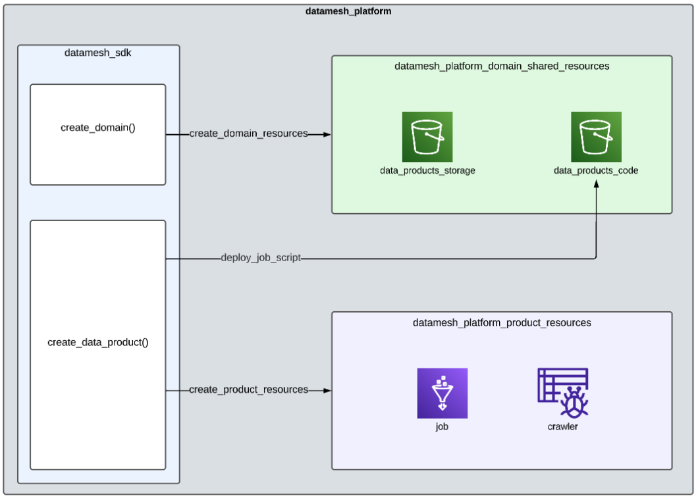

# Data Product creation using AWS CDK - Prototype

## Data Domain and Product Definition

- `data_product_definition.py` file describes the data domain and data product definitions using the sdk-datamesh
- `sdk_datamesh` folder contains the DataPlatform class and AWS CDK stacks for domain and data products components



## Deploy on AWS

- Install AWS CDK locally. This reference can help:
https://medium.com/dataengineerbr/creating-a-local-environment-to-develop-on-aws-cdk-with-docker-and-vscode-f26569d30870

- Setup AWS credentials locally

- Bootstrap AWS Account for deploy
https://docs.aws.amazon.com/cdk/v2/guide/bootstrapping.html

- To manually create a virtualenv on MacOS and Linux:

```
$ python3 -m venv .venv
```

- Activate your virtualenv:

```
$ source .venv/bin/activate
```

- Once the virtualenv is activated, install the required dependencies.

```
$ pip install -r requirements.txt
```

- At this point you can now synthesize the CloudFormation template for this code.

```
$ cdk synth
```

- Finally, deploy CDK project

```
cdk deploy --all
```

## About AWS CDK

API Reference:
https://docs.aws.amazon.com/cdk/api/v2/python/index.html

Developer Guide:
https://docs.aws.amazon.com/cdk/v2/guide/getting_started.html

The `cdk.json` file tells the CDK Toolkit how to execute your app.

This project is set up like a standard Python project.  The initialization
process also creates a virtualenv within this project, stored under the `.venv`
directory.  To create the virtualenv it assumes that there is a `python3`
(or `python` for Windows) executable in your path with access to the `venv`
package. If for any reason the automatic creation of the virtualenv fails,
you can create the virtualenv manually.


To add additional dependencies, for example other CDK libraries, just add
them to your `setup.py` file and rerun the `pip install -r requirements.txt`
command.

## Useful commands

 * `cdk ls`          list all stacks in the app
 * `cdk synth`       emits the synthesized CloudFormation template
 * `cdk deploy`      deploy this stack to your default AWS account/region
 * `cdk diff`        compare deployed stack with current state
 * `cdk docs`        open CDK documentation

Enjoy!
